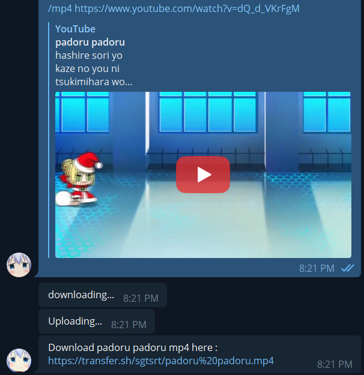
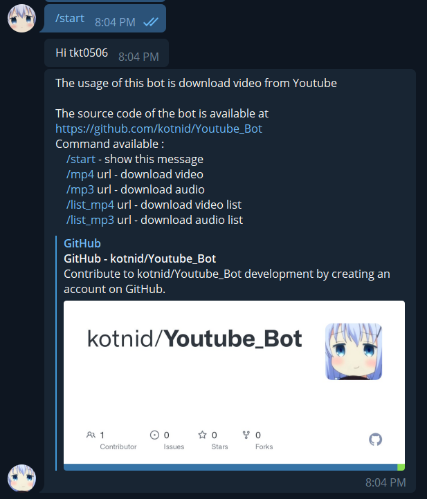
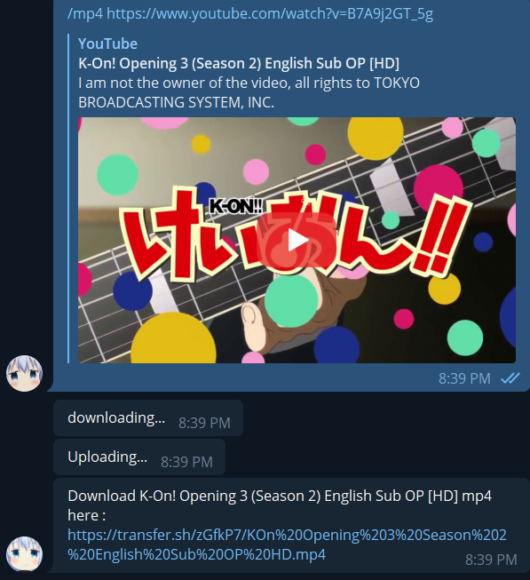
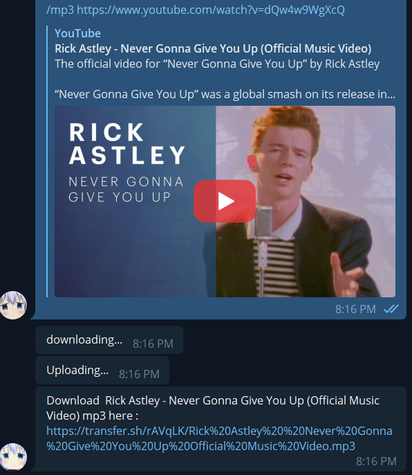
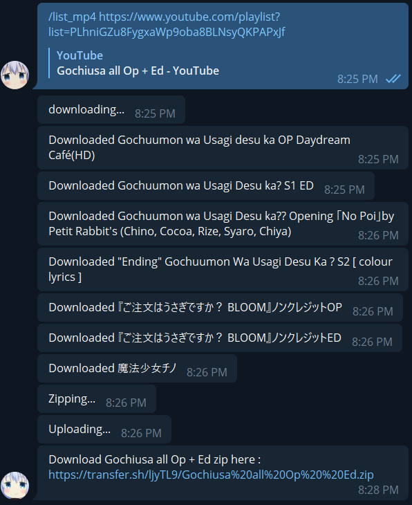
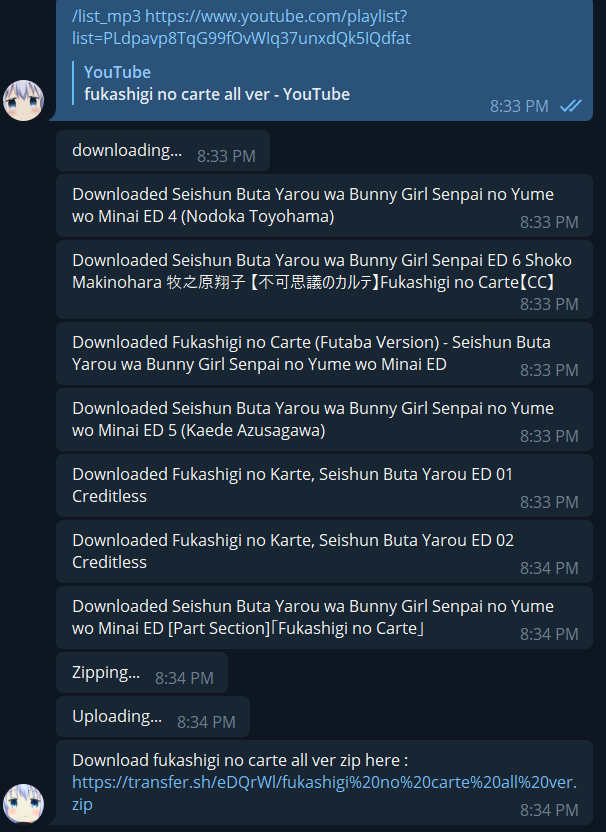

# Youtube Bot #
## download Youtube video by just typing commands in Telegram ##

 

[YouTube bot]("t.me/tkt_Youtube_bot")

---

## Setup ##
1. ``bash setup.sh`` 
2. ``python main.py``

---

## Commands ##
## **``/start``** ##
- show help message

---

## **``/mp4 (url)``** ##
- download Youtube mp4 video 

---

## **``/mp3 (url)``** ##
- download Youtube mp3 video 

---

## **``/list_mp4 (url)``** ##
- download Youtube videos from list  

--

## **``/list_mp3 (url)``** ##
- download Youtube audios from list  

---

## To Do List ##
- song searching
- custom quality 
- ...

---

## Creadit ##
[pytube]("https://github.com/pytube") for downloading video
[transfer.sh]("https://github.com/dutchcoders") for transferring file
[python-telegram-bot]("https://github.com/python-telegram-bot") for using api 
[rain2wood]("https://github.com/rain2wood") for giving suggestion and inspiration